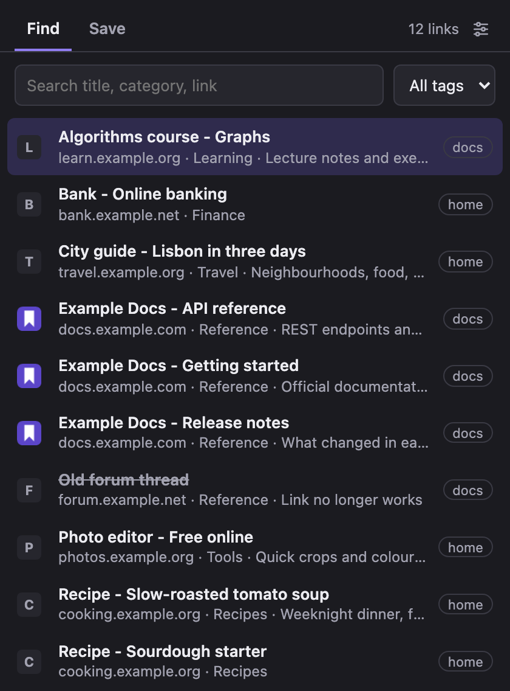
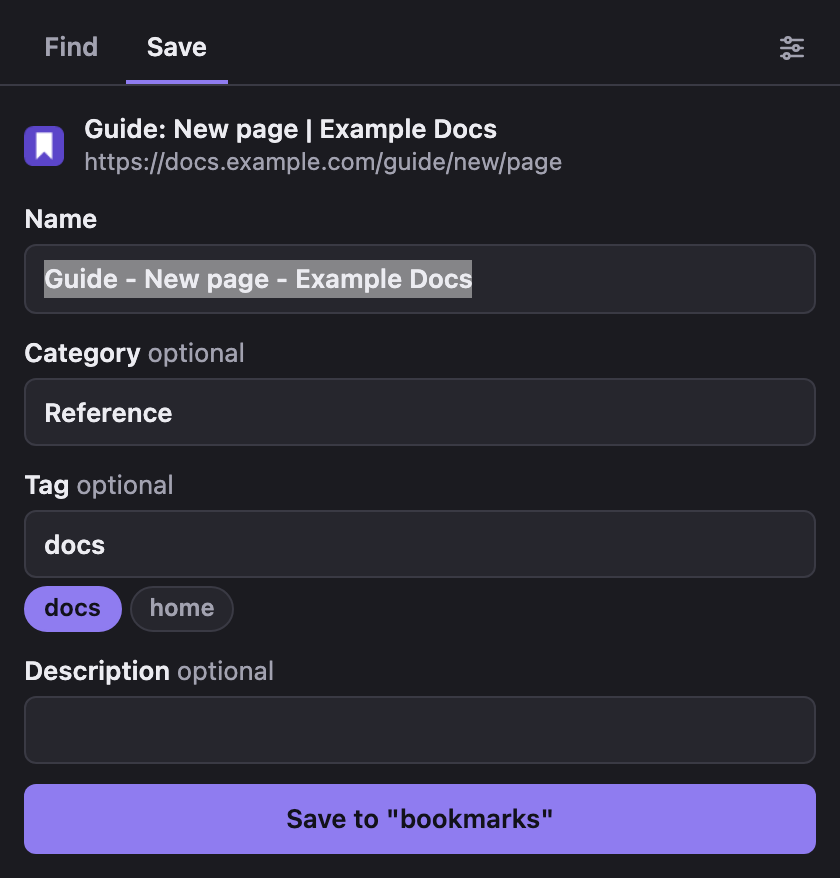

# Vault Bookmarks

Keep your bookmarks as plain Markdown files you own, and search or add them from the Chrome toolbar. The extension reads and writes a folder of notes, one note per link, straight from disk.

It was built for an [Obsidian](https://obsidian.md) vault (the notes are ordinary files with YAML properties, so Obsidian shows them as a table or a list), but it needs nothing from Obsidian: no plugin, no API key, no server, no account. Any folder of Markdown files works, and an empty folder is a fine start. The extension's own code makes no network request; site icons come from Chrome's favicon service. This project is not affiliated with Obsidian.

 

Screenshots use the synthetic notes in `test/fixtures/`.

## Install

The extension is not on the Chrome Web Store: you load it from a copy of this repository.

1. Get the code: `git clone https://github.com/ML9373/vault-bookmarks.git`, or download the ZIP from GitHub and unzip it.
2. Open `chrome://extensions`, turn on **Developer mode**, click **Load unpacked**, and pick the `vault-bookmarks` folder you just got.
3. Click the toolbar icon, then **Open setup**, then **Choose folder** and pick the folder that holds your bookmark notes (or an empty one to start). Pick that folder itself, not a whole vault above it: the setup refuses a folder that contains `.obsidian`.
4. Still on the setup page, check **Note format**. The defaults below suit a folder started from scratch; change the property names if your notes already use others.

## Use

- **Find** (`Cmd+Shift+K` on macOS, `Ctrl+Shift+K` elsewhere, rebindable at `chrome://extensions/shortcuts`): type words from the title, category, description, tag or link. Arrows move, Enter opens, Cmd or Ctrl+Enter opens in the background. The tag filter appears as soon as the notes carry tags. Each link shows the site's icon.
- **Save**: the current tab is pre-filled (an unread counter like `(12)` in front of the title is dropped). Category and tag are suggested from the notes already saved for the same site, and both lists are whatever the notes already use. A link that is already saved is reported instead of duplicated, whatever campaign parameters (`utm_*`, `fbclid`, `gclid`...) it arrives with: the saved link itself keeps its query.

The settings button at the top right of the popup opens the setup page at any time: it shows the current folder (its name, how many notes were read, a few titles to recognise it: Chrome never shares the path), and lets you change the folder, the note format, or allow access again. The Save button also names the folder it writes to.

## Note format

With the default settings a new note looks like this:

```yaml
---
title: "Name"
tags:
  - Bookmark
  - work          # the tag picked in the popup, if any
type: bookmark
URL: "https://..."
Category: "Reference"
Description: ""
BookmarkStatus: "Active"
CreationDate: "YYYY-MM-DD"
aliases:
  - "Name"
---
```

Everything else is configurable on the setup page: the property that marks a note as a bookmark (and its value, or a tag instead), the tag written on every note, the names of the link, category, description, status and creation-date properties (a blank name turns that field off), and a text written under the properties of every new note (a breadcrumb link to your hub, for example). A note whose status is `Dead` is greyed out in the results.

Tags are free: the extension lists the tags it finds in the notes and lets you type a new one. There is no built-in list of categories or tags.

## What it reads

Only the top-level `.md` files of the chosen folder, and only their frontmatter (the first 4 KB, more only when the frontmatter is longer). A note that is not marked as a bookmark, has no http(s) link, or sits in a subfolder is ignored, and no note body is ever parsed or kept. Permissions: `activeTab` (the tab you click the icon on) and `favicon` (site icons, served by Chrome's own favicon service). The extension has no host permission, no content script and loads no remote code.

## Security notes

- The folder permission covers the folder and everything under it. The setup refuses a folder that contains `.obsidian`, but that is a guard against a wrong click, not a security boundary: the boundary is the folder you pick. Pick the narrowest one.
- The extension never deletes or replaces a note: it only creates new files, and refuses a name that exists.
- Values written to a note (title, link, category, tag, description) are JSON-quoted or sanitised, and the text under the properties is the one you configured, so a page title cannot inject a code block into a note.
- Loaded unpacked, the extension is the files in this folder: whoever can edit them can use the folder permission. Keep the folder where only you can write.

## Limits

- Version 0.1.0, used so far in Chrome on macOS only: Windows and Linux are untried. Chrome 122+ on desktop. Other Chromium browsers (Edge, Brave) have the File System Access API but have not been tried, and Firefox, Safari and mobile browsers do not have it.
- Chrome may ask to allow the folder again after a restart: the popup then offers **Allow access**.
- A site Chrome has never loaded shows a globe or a letter instead of its icon.
- The popup reads every note each time it opens. Measured on synthetic notes of about 2 KB in a browser-private folder, not on a real disk: 266 notes in 31 ms, 3,000 in 0.4 s, 10,000 in 1.5 s. A real folder may be slower per file.
- Changing a property name in the settings does not rewrite existing notes: notes under the old name stop showing up.

## Tests

```
node --test "test/*.test.mjs"
```

Node 22 or later (the version the CI uses), no dependency to install. The unit tests cover the frontmatter reader, the settings, the note writer, the naming rules (including names Windows refuses) and the search. An optional check against a real folder of notes is described at the top of `test/unit.test.mjs`.

To try the popup without loading the extension, serve the repository root and open the test page:

```
python3 -m http.server
# then open http://localhost:8000/test/harness.html
```

It runs the real popup against a browser-private folder seeded from `test/fixtures/` (synthetic notes), with the `chrome.*` calls replaced by stubs. Parameters: `?settings=<json>` sets the note format, `?view=save` opens the Save tab, `?title=` and `?url=` set the current tab, `?nohandle` starts with no folder chosen.

## License

MIT
